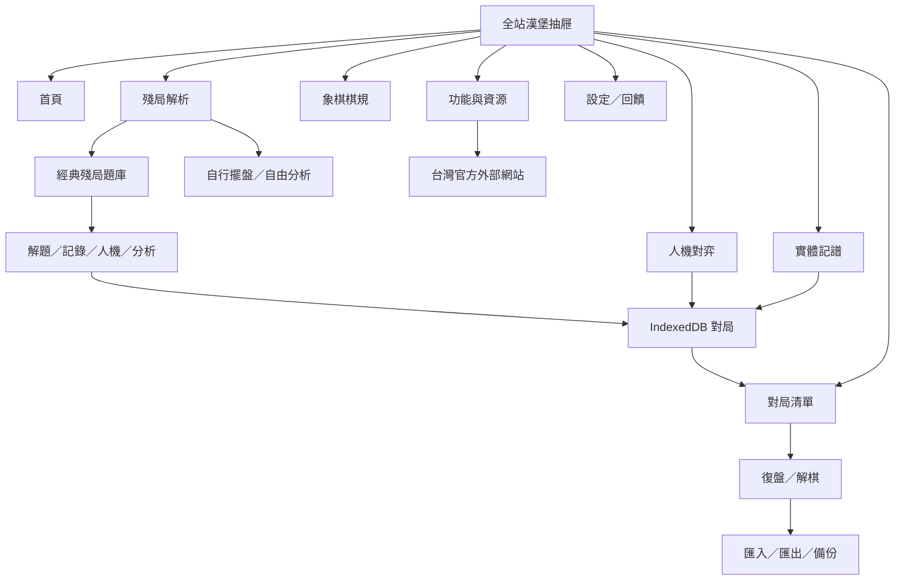
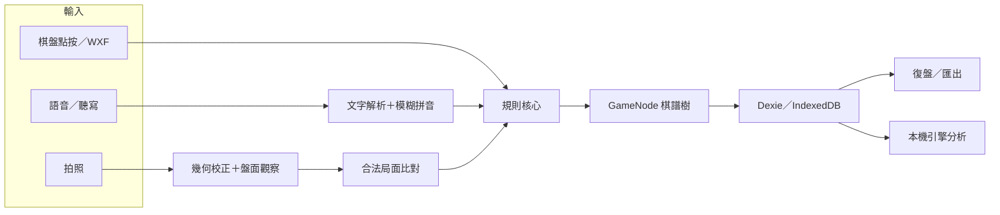

# 象棋記譜 Living SDD

> 文件狀態：Living（持續維護）<br>
> 文件版本：1.36<br>
> 最後更新：2026-07-19<br>
> 程式基準：`main` / `64bf247` / 工作包 018 Verified（待提交／發布）<br>
> 使用者文件：[README.md](../README.md)<br>
> 施工工作包：[docs/sdd/README.md](sdd/README.md)

這份文件是「象棋記譜」的產品與技術單一事實來源。README 回答怎麼使用 App；本文件回答為什麼這樣做、哪些原則不可破壞、資料如何流動，以及下一位施工者應如何安全接手。

若程式現況與本文件不一致，先把差異列為風險，不要默默選一邊。完成修正時，程式與 SDD 必須在同一次施工中同步更新。

## 1. 產品定位

### 1.1 一句話

為實體中國象棋對局提供本機優先、可離線使用的記譜、復盤、解棋與殘局工具。

### 1.2 產品方向

下列三個方向同時保留，不互相排斥：

1. 作者自己在真實棋盤旁使用。
2. 公開免費提供棋友使用。
3. 未來在授權與技術條件允許時商業化。

商業化不得犧牲目前的隱私、本機優先與可攜性。現有 Fairy-Stockfish／NNUE 為 GPL-3.0，任何商店化或閉源方案都必須先重新評估授權邊界；詳細現況見 README 的授權章節。

### 1.3 核心使用情境

- 手機放在棋盤旁，雙方在實體棋盤對弈並即時記譜。
- 使用者透過語音、拍照或點棋盤輸入著法。
- 使用者與本機引擎對弈並自動留下棋譜。
- 對既有棋局復盤、建立變著、加註解、匯入與匯出。
- 以本機引擎解棋、查看失誤與建議變化。
- 從空盤或照片建立殘局並分析。

### 1.4 現階段非目標

- 不建立帳號、雲端後端或跨裝置即時同步。
- 不宣稱 App 的級／段等同協會認證棋力。
- 不把使用者的棋譜、照片、校準資料自動上傳。
- 不把純討論、規劃或尚未驗收的施工部署到正式站；已確認且驗證完成的功能／介面施工預設直接部署。

## 2. 已確認的產品決策

| ID | 決策 | 不可破壞的界線 |
|---|---|---|
| D-001 | 本機優先、零後端 | 對局與設定預設只存在目前瀏覽器的 IndexedDB。 |
| D-002 | 三條主要輸入路徑等權 | 語音、拍照、點棋盤都必須容易發現；WXF 鍵盤屬手動輸入的輔助方式。 |
| D-003 | 台灣繁體中文與象棋品牌 | 首頁使用「帥」等中國象棋視覺，不使用西洋棋 `♟️` 作品牌圖示。 |
| D-004 | 難度使用台灣棋友熟悉的級／段名稱 | UI 隱藏西洋棋 Elo；必須清楚說明這是 App 相對階梯、不是棋力認證。 |
| D-005 | 先建立 10 個固定校準錨點 | 錨點設定須可版本化，之後才能逐步補齊完整段級。 |
| D-006 | 段級校準先在本機收集 | 校準資料不自動跨裝置；需要透過版本化匯出／匯入搬移或合併。 |
| D-007 | 校準實驗室預設隱藏並以 PIN 開啟 | PIN 只防止誤入，不可宣稱是強加密或真正權限系統。 |
| D-008 | 完成施工後預設 commit、push、deploy | 通過驗證後依序提交、推送、Firebase 部署並驗證正式站；當次明確要求不部署時才略過。 |
| D-009 | 棋規以協會 113 年修訂版為參考，確定規則才自動判定 | App 自動處理合法著法、絕殺與困斃；重複盤面、自然限著與長捉只提示／輔助，不冒充正式裁判。 |
| D-010 | 全站公開功能由漢堡抽屜統一導覽，外部資源採版本化快照 | 內建功能說明可離線；賽程需標示查閱日期與官方來源，不得冒充即時同步；段級校準仍不列入公開選單。 |
| D-011 | 復盤接續採「從此局面建立獨立新局」 | 來源棋譜不可被後續記錄、引擎走子或悔棋修改；新局保存自含來源快照，計著與循環統計從選中盤面重新開始。 |
| D-012 | `package.json.version` 是 App 的單一人工維護版本來源 | 設定、回饋診斷、校準匯出與後續備份只能共用 build-time 封裝的版本模組，不得各自硬編碼。 |
| D-013 | 完整備份採 schema v2、安全 allowlist、段級 PIN 門禁與原子 merge | 只搬移明確可攜資料；Token／PIN gate 永不匯出，含段級原始資料時當場驗證本機 PIN，先完整驗證再以單一交易寫入，任何不可判定衝突不得靜默覆寫。 |
| D-014 | 段級校準的選著核心先以 inactive、可重播協定獨立施工 | 固定單執行緒／nodes／fresh hash 與引擎資產，使用 seeded MultiPV policy 並記錄完整 decision；沒有真人資料前不得稱為已具真人感或對應台灣段級，也不得開放校準對弈。 |
| D-015 | 段級 gate v1 與 archive/game versions 分離；v2 採自含快照、嚴格原子匯入與版本隔離統計 | 既有 PIN 不得因資料升版失效；同 ID 異內容整包拒絕，不同 protocol／engine／search／rank／side／App version 不可混成同一勝率。 |
| D-016 | 一般人機對弈先進入獨立設定 view | 首頁、漢堡選單與功能指南共用同一入口；姓名、紅黑方與相對級段設定不得再附加在首頁內容最下方。 |
| D-017 | App shell 使用完整可用視窗，內容寬度由各頁局部控制 | iPad、橫向與分割視窗不得再受全域 640px 上限或 portrait 鎖定；滿版不代表隱藏 iPadOS 系統區域，也不把文字與棋盤無限制拉寬。 |
| D-018 | 互動棋盤以內容容器的實際可用空間決定尺寸 | 不以 viewport 高度百分比作為人機對弈棋盤的主要限制；SVG 必須有明確內在尺寸與等比例契約，避免 iPadOS standalone 首次排版依賴旋轉重算。 |
| D-019 | 解棋採棋盤與分析責任分離的響應式工作台 | 直向與寬橫向都要讓棋盤尺寸和分析內容捲動各自負責；分析內容增長不得再參與棋盤尺寸分配。 |
| D-020 | PWA 更新必須由使用者確認，版本描述由 package 單一來源在 build 時產生 | 等待中的新版不得在記譜／對弈途中自動重載；版本描述檔不進 precache 且 no-store，每次正式功能發布必須更新 package version。 |
| D-021 | 經典殘局採可追溯的公版古譜、版本化靜態題包與四種局面入口 | 內建包須涵蓋五階相對難度；額外包只在使用者主動下載後保存本機；每題可解題、開始記錄、人機對弈或自由分析。不得散布授權不明的現代棋圖、註解或解答，也不得把五階宣稱為協會級段。 |
| D-022 | 解棋分析窗固定展開，不再讓使用者管理三段高度 | 直向保留大棋盤並以頁面自然捲動承擔總高度；標題與四分頁固定可見，只有分析內容獨立捲動；寬橫向維持雙欄。 |

## 3. 現行功能基準

| 區域 | 現況 | 主要入口／檔案 |
|---|---|---|
| 首頁 | 「帥」品牌、3D 中國漫畫風卡片、山景祥雲背景、三種輸入提示、最近對局 | `src/ui/HomePage.tsx`, `src/styles.css` |
| 全站導覽 | 上方品牌列、漢堡按鈕、左側可收納抽屜與全部公開功能捷徑 | `src/ui/AppMenu.tsx`, `src/content/guide.ts` |
| 功能與資源 | 完整 App 使用說明、台灣官方教學／棋規連結、標示查閱日的近期賽程 | `src/ui/GuidePage.tsx`, `src/content/guide.ts` |
| 實體記譜 | 姓名、先手、面對面模式、語音／WXF／棋盤點按／照片、合法著法、悔棋 | `src/ui/RecordPage.tsx` |
| 人機對弈 | 獨立設定頁、執紅／執黑、級段階梯、提示、悔棋、認輸、自動記譜 | `src/ui/PlaySetupPage.tsx`, `src/ui/PlayPage.tsx`, `src/ui/playLevels.ts` |
| 對局清單 | 依復盤或分析意圖選局 | `src/ui/GamesPage.tsx` |
| 復盤 | 主線／變著、播放、註解、從任一步另開記譜／對弈局、匯入、匯出、完整本機備份 v2 | `src/ui/ReplayPage.tsx`, `src/ui/ContinueFromReplayDialog.tsx`, `src/ui/ImportDialog.tsx` |
| 解棋 | 本機引擎逐著分析、評分曲線、著法標記、建議變化；固定展開對照工作台與四個分析分頁 | `src/engine/analysis.ts`, `src/ui/ReplayPage.tsx` |
| 經典殘局與擺盤 | 《適情雅趣》12 題五階離線包、48 題主動下載包、搜尋／難度／來源／進度篩選、解題／記錄／人機／分析四入口，以及擺盤合法性檢查、照片擺盤、MultiPV 分析與試走 | `src/endgames/`, `src/store/endgameLibrary.ts`, `src/ui/EndgameLibrary.tsx`, `src/ui/EndgamePage.tsx` |
| 拍照辨識 | 棋盤偵測、透視校正、紅黑／空格判斷、合法著法比對、棋子分類 | `src/vision/` |
| 棋子外觀校準 | 拍標準開局照，建立目前棋具的本機範本 | `src/ui/CalibrateDialog.tsx`, `src/vision/templates.ts` |
| 段級校準實驗室 Phase 1＋2A／2B／2C | 預設隱藏、PIN 上鎖、10 個固定錨點、匿名協助者、schema v1/v2 原子匯入／匯出與版本隔離統計；已接上 fixed-nodes／seeded MultiPV 現場對弈、紅黑交替、逐著 CAS 保存與中斷續局 | `src/calibration/`, `src/engine/engineClient.ts`, `src/store/rankCalibration.ts`, `src/store/rankCalibrationMatch.ts`, `src/ui/RankCalibrationPage.tsx` |
| 棋規中心 | 113 年版勝負和摘要、循環判定矩陣、長捉例外與實體規則邊界 | `src/core/adjudication.ts`, `src/ui/RulesPage.tsx` |
| 設定 | 語音、面對面模式、分析強度、照片校準、授權資訊；feature gate 開啟後顯示段級校準入口 | `src/ui/SettingsPage.tsx` |
| 回饋 | 透過使用者自己的郵件 App 寄送，可附診斷資訊 | `src/ui/FeedbackDialog.tsx` |
| PWA 更新 | 新版等待時顯示目前／可用版本，可稍後、單次套用或在失敗後重試；版本描述不進 precache | `src/pwa/`, `src/ui/PwaUpdatePrompt.tsx`, `vite.config.ts` |

注意：「棋子外觀校準」與未來的「段級棋力校準」是兩套不同功能。命名、資料表與畫面不可混用。

## 4. 穩定需求與驗收依據

| ID | 需求 | 最低驗收 |
|---|---|---|
| FR-HOME-001 | 首頁一眼可辨識為中國象棋 App。 | 不出現西洋棋品牌圖案；主要功能可由鍵盤與觸控操作。 |
| FR-NAV-001 | 任一頁都能找到所有公開功能。 | 上方漢堡按鈕開啟左側抽屜；Escape、遮罩與關閉按鈕可返回，段級校準不出現在公開清單。 |
| FR-RESOURCE-001 | 棋友可分辨內建說明、外部官方資源與賽程時效。 | 功能說明離線可讀；外連標示來源，賽程標示查閱日與「以最新公告為準」。 |
| FR-INPUT-001 | 語音、拍照、點棋盤三路徑等權呈現。 | 首頁或記譜入口同時呈現三者，不以其中一種取代其他路徑。 |
| FR-RECORD-001 | 只有符合目前局面的合法著法可寫入棋譜。 | 所有輸入最後都經過規則核心驗證。 |
| FR-DATA-001 | 對局進度必須持續保存。 | 中途離開後可從 IndexedDB 回到未完成對局。 |
| FR-REPLAY-001 | 棋譜可保留主線、變著與註解。 | 匯出／匯入後結構不應靜默遺失。 |
| FR-BACKUP-001 | 使用者可主動搬移安全範圍內的完整本機資料。 | v2 可攜帶棋局、名冊、五項偏好與兩種校準資料；v1 相容；Token／PIN gate 不在檔案中；含段級原始資料時當場驗證本機 PIN；還原失敗零部分寫入。 |
| FR-ENGINE-001 | 引擎只在支援的瀏覽器環境啟用。 | 缺少 HTTPS、COOP／COEP 或 SharedArrayBuffer 時，記譜仍可用並顯示說明。 |
| FR-RANK-001 | 對弈難度顯示台灣棋友可理解的級／段。 | UI 不顯示內部 Elo，且不暗示協會認證。 |
| FR-RULES-001 | 棋友可在 App 內查閱適用的勝負和及循環棋規。 | 不把重複盤面直接判和；循環矩陣符合協會 113 年版，複雜長捉保留人工確認。 |
| FR-CAL-001 | 未來段級校準資料預設只在本機累積。 | 無網路請求；不同瀏覽器／裝置不會自動共享。 |
| FR-PRIVACY-001 | 棋譜、照片、校準結果不得在未告知下離開裝置。 | 任何新增上傳／分析服務都要另開 SDD 並取得明確同意。 |
| FR-RELEASE-001 | 每次施工可重現、可追查、可直接檢視。 | SDD、測試、build、commit、push、Firebase deploy 與 live verification 都有紀錄。 |
| FR-VIEWPORT-001 | App 在手機、平板、直向、橫向與分割視窗使用系統實際分配的完整畫布。 | root／header 不受 640px 上限；無水平 overflow；safe-area 保留，長文與棋盤以局部最大寬度維持可讀性。 |
| FR-VIEWPORT-002 | 人機對弈棋盤首次進入與旋轉後都以實際內容空間穩定排版。 | 不依賴 `vh` 限高；SVG 有固定比例，棋盤、狀態與操作列在 iPad 直／橫向可用範圍內。 |
| FR-ANALYSIS-001 | 解棋時可穩定對照棋盤與分析結果。 | 分析前／中／後與分頁切換時棋盤尺寸不變；直向分析窗固定展開且內容獨立捲動，寬橫向為雙欄，曲線／關鍵著／棋譜皆可同步棋盤。 |
| FR-UPDATE-001 | 使用者可知道新版已就緒並自行決定更新時機。 | 顯示目前／可用版本；可稍後或立即更新；不自動打斷操作、連點只套用一次，失敗可重試。 |
| FR-ENDGAME-001 | 棋友可從可追溯的公版古譜題庫，依五階相對難度選擇解題、實體記錄、人機對弈或自由分析。 | 首次離線可使用五階內建題；額外包須明確下載、整包驗證並在重開後離線可用；四入口控制方與文案一致；保存來源快照且不把難度冒充協會級段。 |

## 5. 使用者流程與導航

目前沒有 URL Router；`src/App.tsx` 以 React state 保存當前 View。重新整理頁面會回到首頁，這是現況而不是保證不變的產品需求。所有 view 共用 App shell，上方品牌列的漢堡按鈕開啟左側抽屜；抽屜只列公開功能，隱藏段級校準仍依 SDD 002 的本機 feature gate 與 PIN 流程進入。



### 5.1 全站導覽與外部資源

- 首頁、開始紀錄、人機對弈、復盤、解棋、殘局、棋規、功能與資源、設定、回饋都必須出現在公開抽屜。
- 「開始紀錄／回饋」由 drawer 回首頁開啟既有 dialog；「人機對弈」進入獨立設定 view，首頁、drawer 與功能指南共用同一建局流程。
- 功能與資源頁的完整產品說明隨 App shell 打包，不需網路；只有使用者點擊教學、棋規、活動或報名連結時才連至外部網站。
- 賽程是 `checkedAt` 版本快照，不做 runtime fetch。任何日期、場地、資格或名額都以主辦單位最新公告為準。
- 第一版外部資源只收錄可追溯的中華民國象棋文化協會頁面；列入不代表合作、認證或涵蓋台灣全部資源。

詳細規格見 [005-global-menu-and-taiwan-resource-centre.md](sdd/005-global-menu-and-taiwan-resource-centre.md)。

### 5.2 實體記譜輸入

三條主要產品路徑如下：

1. **語音**：Web Speech API；不支援時降級為系統鍵盤聽寫。
2. **拍照**：照片 → 棋盤四角 → 透視校正 → 90 格觀察 → 合法著法候選 → 使用者確認。
3. **點棋盤**：點起點與終點直接走子。

WXF 代號鍵盤是手動輸入的進階輔助，不另算第四條產品入口。無論來源為何，寫入前都必須經過合法著法與目前局面檢查。

### 5.3 棋規與對局判決

棋規中心依中華民國象棋文化協會《中華民國象棋規則 113 年修訂版》整理，只收錄 App 情境需要的部分：

- 合法著法、絕殺與困斃由規則核心自動判斷。
- 協議和、認輸、超時與賽事犯規由棋友確認後記錄。
- 連續 100 著未吃子只提示自然限著審查，不自動結束。
- 循環局面由棋友先分類雙方為長將、長捉或未犯例，再由 App 套用比較矩陣；相同局面重複本身不等於和棋。
- 摸子、離手、按鐘、遲到與賽場紀律等 App 無法觀察的規則不納入自動判定。

長捉牽涉根子、同類子、牽制、兵卒／將帥及分捉多子等例外。在沒有裁判案例資料與專家驗證前，不得把自動長捉分類標示為可靠功能。詳細規格見 [004-xiangqi-rules-centre.md](sdd/004-xiangqi-rules-centre.md)。

## 6. 技術架構

### 6.1 技術棧

- React 18 + TypeScript + Vite。
- Dexie／IndexedDB 本機資料庫。
- `vite-plugin-pwa` 與 Service Worker 離線快取。
- `package.json.version` 由 `src/version.ts` 在 build 時封裝；另由 build 產生 no-store、非 precache 的 `/app-version.json`，只有等待中的新版被偵測到時才供舊 bundle 查詢新版版本。
- backup schema v2 以 runtime allowlist validator、Float32 LE base64 codec 與 Dexie 單一 transaction 提供本機資料可攜性；`fake-indexeddb` 只供 Node transaction tests。
- 經典殘局以版本化 JSON 題包、runtime schema／棋規驗證與 IndexedDB `settings` 儲存提供主動下載後離線使用；內建題包隨 App 發佈。
- Fairy-Stockfish Xiangqi WASM + NNUE，透過 Web Worker 執行。
- 純 TypeScript 規則、記譜、照片幾何與分類流程；執行期不依賴 OpenCV 或雲端模型。
- Firebase Hosting 正式部署；`public/_headers` 保留其他支援自訂標頭的平台。

### 6.2 資料與運算流



### 6.3 模組責任

| 目錄 | 責任 | 變更注意事項 |
|---|---|---|
| `src/core/` | 棋盤、FEN、合法著法、記譜格式、棋譜樹、匯入／匯出 | 應維持純函式與高測試覆蓋；UI 不得自行重寫規則。 |
| `src/store/` | Dexie schema、設定、玩家名冊、備份 | schema 變更必須版本化並設計 migration。 |
| `src/speech/` | 能力偵測、一次語音辨識、TTS | 平台差異以執行期偵測處理。 |
| `src/vision/` | 棋盤偵測、透視、分類、合法著法比對、棋子範本、CNN | 真實照片資料不足時不可誇大準確率。 |
| `src/engine/` | Worker 引擎介面、全局排隊、逐著分析 | 每次分析都要明確重設限制棋力，避免弱棋設定污染解棋。 |
| `src/calibration/` | 段級校準 schema、PIN KDF 與版本固定錨點 | 不可把底層尺度顯示為中國象棋段級；任何影響棋力的設定變更都要換 config version。 |
| `src/endgames/` | 經典殘局題包 schema、來源權利帳、內建題與下載 catalog | 每包須可追溯、版本化並整包驗證；不得納入授權不明的現代註解、解答或掃描內容。 |
| `src/content/` | 隨版本發佈的公開導覽、教學資源與賽程快照 | 外部來源需可追溯；時效內容必須有查閱日、單元測試與非即時聲明。 |
| `src/ui/` | 頁面、對話框、棋盤互動、產品文案 | 維持台灣繁中、觸控優先、鍵盤可達與一致視覺。 |
| `public/engine/` | Worker、WASM、NNUE | 大檔快取與 GPL 來源必須可追溯。 |
| `training/` | 開發側 CNN 合成資料與訓練 | 產物須可重現；不得提交授權不明資料。 |

## 7. 資料模型與資料邊界

### 7.1 目前 Dexie schema（version 2）

- `games`：對局基本資料、模式、玩家、結果、初始 FEN、棋譜樹、著數、分析結果，以及 optional 復盤接續／殘局來源自含快照。
- `players`：曾使用的玩家名稱。
- `settings`：key/value 設定；包含語音、分析、面對面模式、`pieceCalibration` 棋子範本、已驗證的額外殘局題包與本機練習進度。
- `rankCalibrators`：匿名協助者 profile、自報級／段、制度來源與本機同意時間。
- `rankCalibrationGames`：保存 immutable schema v1 legacy 與 self-contained schema v2 校準原始棋局；PIN 內現場 controller 會先保存 ply 0，再以 CAS transaction 逐著更新同一筆 v2 row。

version 2 只新增上述兩張表，不改寫既有 `games`、`players`、`settings`。段級校準 feature gate 與 salted PIN verifier 存在 `settings.rankCalibrationGate`；unlock flag 只存在 React memory。

對局以 `GameNode` 樹保存主線與分支，不是單純的線性著法陣列。修改棋譜時要保留節點 ID、主線順序與分支語意。

從復盤局面接續時不修改或共用來源樹，而是以選中節點 FEN 建立空白新 root；`GameRow.continuedFrom` 保存 schema v1 的來源節點、ply、姓名、日期與 FEN 快照。來源數字 ID 只供建立當下稽核，不可當作跨裝置永久外鍵。詳細規格見 [006-continue-from-replay-position.md](sdd/006-continue-from-replay-position.md)。

從經典殘局建立記錄、人機或解題局時使用同一個任意合法 FEN 建局核心，不修改題包；`GameRow.endgameSource` 保存 pack／puzzle ID、題名、原作、原題序、初始 FEN 與啟動模式。刪除下載包後，既有棋局仍可由快照追溯。詳細規格見 [017-classic-endgame-library.md](sdd/017-classic-endgame-library.md)。

### 7.2 本機資料的實際範圍

- 資料屬於「瀏覽器 profile + 網站 origin」。
- `https://xiangqi-recorder.web.app`、`http://localhost` 與其他網域彼此不共享資料。
- 換電腦、換瀏覽器、清除網站資料或使用無痕模式都可能看不到原資料。
- 目前不會自動同步；唯一可攜方式是使用者主動匯出與還原。

### 7.3 完整本機備份 v2

backup schema v2 包含：

- 完整 `games` 樹與自含接續／殘局來源快照；portable stable ID 等於 root node ID。
- 玩家名冊。
- 五項一般偏好：語系、語音覆誦、連續語音、分析時間與面對面模式。
- 以 `float32-le-base64` 明確編碼的棋子照片校準衍生範本；不含原始照片。
- 段級校準 nested schema v1／v2 的 frozen anchors、profiles 與 mixed v1/v2 games 技術快照。
- `appVersion`、backup `version` 與 `exportedAt`。

檔案永遠排除 `llmToken`、`rankCalibrationGate`、PIN、salt／verifier、enabled／auto-lock 與 unlock 狀態。JSON 未加密，可能含棋譜、棋手姓名、匿名協助者代號、自報級段與 notes，必須在 UI 提醒使用者妥善保管。

v1 games-only 檔仍可還原；v2 選檔先預覽，確認後才進 transaction。還原只 merge、不刪除；相同 stable ID 同內容略過，不同內容整包中止。五項偏好套用備份值，來源沒有棋子範本時不刪目的端，兩端不同時先保留目的端。匯出與匯入共用 UTF-8 50 MiB 上限，不產生 App 自己無法還原的超限檔。

只要完整備份含協助者 profile 或校準對局，匯出與還原都要驗證目前 origin 的段級實驗室 PIN；PIN 不保存也不進檔案，新電腦須先由 setup 入口建立本機 PIN。主線改變時舊解棋分析會立即清除；更新前已存在或舊 v1 檔中的錯置 review 屬可重新產生的衍生資料，匯出／還原會略過並明確提示數量，不讓它阻塞棋局本體。詳細規格見 [008-portable-backup-v2.md](sdd/008-portable-backup-v2.md)。

工作包 008 已於 2026-07-17 發布：17 個 test files／123 tests、production build、桌面瀏覽器的下載／預覽／取消／確認／重複匯入，以及 320／390／640 px 響應式流程均通過；implementation commit 為 `4756056`，正式站顯示 v0.4.0 並完成隔離 origin 的零局匯出／還原／重複還原驗證。

## 8. 引擎難度與段級校準

### 8.1 現行難度

`src/ui/playLevels.ts` 提供 `業餘10級` 到 `業餘9段` 的相對階梯。內部目前使用引擎限制棋力與思考時間形成單調難度，但底層尺度不是中國象棋協會等級分。

產品界線：

- UI 只顯示級／段名稱，不顯示西洋棋 Elo。
- 不可由「擊敗某段」推論使用者擁有該段位。
- 提示、復盤與解棋應使用全力，不受對弈弱棋力設定污染。
- 對局紀錄保存當時的引擎顯示名稱，避免日後改表導致舊棋譜改名。

### 8.2 校準方向

目前沒有人類棋手可立即協助校準，因此公開難度表仍是未驗證的相對階梯。下一階段採用：

1. 建立 10 個版本固定的內部錨點。
2. 引擎落子加入可記錄、可重現的人類化選著策略。
3. 建立預設隱藏、PIN 解鎖的本機校準實驗室。
4. 協會棋手先輸入自己的級／段，再像正常對弈一樣完成校準棋局。
5. 原始棋局與統計只保存在當前電腦／瀏覽器；透過匯出檔帶回分析。
6. 資料足夠後才版本化發布映射，逐步補齊完整段級。

Phase 1 已凍結 `A01`～`A10` 的 `2026.07-v1` 設定並完成本機 PIN／profile 骨架；工作包 009 已發布 `2026.07-phase2-v1` 工程協定，工作包 010 已發布 self-contained game v2、安全匯入與版本隔離統計。工作包 011 已驗證 PIN 內現場對弈 controller：固定 nodes／seeded MultiPV、偶紅奇黑、ply 0 先保存、逐著 CAS checkpoint、中斷續局與人工規則裁定；公開段級映射仍保持未發布。

詳細施工規格見 [002-local-rank-calibration-lab.md](sdd/002-local-rank-calibration-lab.md)。

## 9. 非功能需求

### 9.1 離線與可靠性

- App shell、規則、既有棋譜、照片運算與已快取引擎可離線。
- 經典殘局內建十二題可直接離線使用；額外題包只在使用者按下下載時讀取同站 JSON，驗證後保存 IndexedDB，練習進度不自動上傳。
- 功能與資源頁的內建說明可離線；教學、官方棋規與賽程外部連結需要網路，App 不會在背景主動抓取。
- Android Web Speech API 可能需要網路；iOS standalone 走系統聽寫降級。
- NNUE 首次使用需下載約 11 MB，成功後由 Service Worker 快取。
- IndexedDB 寫入失敗時不得假裝已保存；重要資料操作應提供可理解的錯誤。

### 9.2 隱私與安全

- 零後端是預設架構，不是暫時省略的實作細節。
- 照片只在本機記憶體處理，除非另有明確、可撤回的上傳同意。
- Feedback 使用 `mailto:`，最終寄送由使用者在郵件 App 確認。
- 未來 PIN 僅作功能門禁；本機前端無法對有裝置與開發工具權限的人提供真正機密性。
- 公開完整備份入口不得繞過段級實驗室門禁；含 profiles／校準對局時必須驗證本機 PIN，但仍要明說 JSON 本身未加密且可能含校準備註。
- 不得把 API Token、密碼、真實棋手個資或未匿名校準資料提交到 Git。

### 9.3 可用性與無障礙

- 觸控目標應適合手機；不得只靠 hover 表達狀態。
- 互動元素需有可辨識名稱與 `focus-visible` 狀態。
- 支援窄螢幕、safe-area、深色模式與 `prefers-reduced-motion`。
- App shell 支援完整可用 viewport、iPad 直向／橫向與分割視窗；內容區依用途局部限制寬度，不以全域手機上限裁切畫布。
- 人機對弈棋盤由 page flex container 的剩餘空間配置，SVG 明確保留 9:10 比例；不得要求 iPad 使用者先旋轉才能取得正確滿版。
- 文案使用台灣繁體中文與全形中文標點。

### 9.4 部署條件

- 正式站必須是 HTTPS。
- 引擎需要 `Cross-Origin-Opener-Policy: same-origin` 與 `Cross-Origin-Embedder-Policy: require-corp`。
- `firebase.json` 與 `public/_headers` 必須同步保留上述標頭。
- Service Worker／`index.html` 的 cache policy 不可讓新版長期卡在舊 shell。

## 10. 品質門檻與 Definition of Done

每一個施工工作包至少完成：

1. 施工前建立或更新工作包 SDD，寫明範圍、非範圍、風險與驗收條件。
2. 程式、測試與使用者文案同步修改。
3. 執行與改動相稱的測試；基準指令為 `npm test`。
4. 執行 `npm run build`，不得留下新增的編譯或 CSS syntax error。
5. UI 變更至少檢查 320、390、640 px；重要流程需實際點擊。
6. IndexedDB／PWA／相機／語音等瀏覽器能力，應在真正支援該 API 的瀏覽器驗證；受限的自動化瀏覽器不能替代實機。
7. 更新 master SDD、工作包狀態與 README（若使用方式改變）。
8. 檢查 `git diff`，只提交本次範圍。
9. 建立語意清楚的 commit 並 push 到遠端。
10. 已確認的功能／介面施工預設在 push 後 deploy，並驗證正式 URL；當次明確說不要部署時才停在 Git。

目前已發布驗證基準（2026-07-18）：30 個 test files、227 tests 全部通過。

## 11. 開發與發布 Runbook

```bash
npm install
npm test
npm run build
npm run dev
```

Git 施工收尾：

```bash
git status --short
git diff --check
git add <本次檔案>
git commit -m "<type>: <清楚摘要>"
git push origin <目前分支>
```

正式部署（已確認施工完成後的預設步驟）：

```bash
npm run build
firebase deploy --only hosting
```

部署後還要驗證首頁、Service Worker 更新、`crossOriginIsolated` 與引擎載入。不要因為 Git push 或 Firebase CLI 回報成功，就跳過正式網址檢查。

## 12. 已知風險與技術債

| 項目 | 影響 | 建議 |
|---|---|---|
| 完整備份 JSON 未加密且上限 50 MiB | 檔案可含姓名、校準備註與衍生棋子範本；超限資料不能單檔搬移。 | UI 持續提示妥善保管；若實際資料接近上限，另開 SDD 設計分卷或串流格式。 |
| 不同棋子範本不自動覆蓋 | 換裝置還原時若目的端已有不同範本，現行策略只保留目的端版本。 | 維持非破壞回報；需要人工選擇時另開工作包。 |
| 無 URL Router | 重新整理會回首頁，無法深連結到棋局。 | 若要改，另開 SDD 並處理 PWA rewrite。 |
| 級段尚未經人類校準 | 顯示名稱可能與真實棋力落差很大。 | 維持免責文字，完成 002 工作包後再發布映射。 |
| 實驗性選著尚未經真人驗證 | 可重播與參數單調只證明工程性質，不能證明像真人或對應某級段。 | 工作包 009 固定策略／seed／decision；待協會棋手資料後才校準參數與公開映射。 |
| 長捉無法可靠自動分類 | 循環局面若直接自動判決可能誤判勝負。 | 維持人工分類＋矩陣輔助；取得裁判案例與專家驗證後另開 SDD。 |
| 近期賽程是人工版本快照 | 部署後活動可能延期、取消、額滿或新增。 | 顯示查閱日與非即時聲明；每次相關發布重新查核，永遠保留官方活動總表。 |
| CNN 主要由合成資料訓練 | 真實棋具泛化能力未知。 | 以使用者棋子範本為主，累積合法且有授權的實拍驗證集。 |
| Web Speech 平台差異 | iOS PWA 與部分瀏覽器無即時辨識。 | 保留鍵盤聽寫與手動輸入降級。 |
| 引擎依賴 COOP／COEP | 錯誤部署會讓分析失效。 | 部署後檢查標頭與 `crossOriginIsolated`。 |
| iPadOS standalone 首次 viewport 與 SVG 排版時序 | 自動化代表尺寸可能正常，但實體裝置首次直向進對弈仍裁切，旋轉後才恢復。 | 工作包 014 移除對弈棋盤 `vh` 依賴並固定 SVG 比例；正式發布後以同一台 iPad Air 冷啟補驗。 |
| 復盤棋盤與分析內容共用單一直向 flex 欄 | 完成分析後曲線、統計與關鍵著可能壓縮棋盤，難以邊看局面邊閱讀。 | 工作包 015 將棋盤／分析分窗；工作包 018 再移除直向三段控制，改為固定展開、內容獨立捲動並保留寬橫向雙欄。 |
| v0.7.0 舊頁尚未具備確認式更新 UI | 同一瀏覽器若仍開著多個 v0.7.0 分頁，等待中的新版 Service Worker 可能暫時無法接管，分頁仍顯示舊 shell。 | 全部關閉舊正式站分頁後再開根網址即可接管，不需清除網站資料；v0.8.0 起的後續版本改由確認式 prompt 處理。 |
| 公版古譜與現代整理版本的權利界線 | 古譜原作已進公版，不代表現代掃描、翻印、題庫選編、註解或解答都可再散布。 | 每個題包保留來源與權利帳；production 只納入自行轉錄、驗證與編排的局面事實和自寫標籤，不收現代掃描／註解／解答。 |
| 殘局五階尚未經真人校準 | 編輯評估能維持產品內相對分層，但不能直接對應台灣協會級／段。 | UI 明示「App 題庫難度」；收集足夠真人盲測後才另開 SDD 調整版本或研究映射。 |
| GPL 商業限制 | iOS App Store／閉源散布有風險。 | 商業決策前做正式法律與架構評估。 |

## 13. 路線圖

### 已發布

- 首頁中國象棋品牌與卡片視覺整理（工作包 001，2026-07-16 發布）。
- 首頁 3D 中國漫畫風主題（工作包 003，2026-07-16 發布）。
- 本機段級校準實驗室 Phase 1（工作包 002，2026-07-16 發布；後續 phase 仍需另行核准）。
- 象棋棋規中心與循環判定輔助（工作包 004，2026-07-17 發布）。
- 全站漢堡導覽與台灣象棋資源中心（工作包 005，2026-07-17 發布）。
- 從復盤局面接續記錄或對弈（工作包 006，2026-07-17 發布）。
- 單一 App 版本來源與 PWA 三輸入描述（工作包 007，2026-07-17 發布）。
- 完整本機備份 v2 與安全還原（工作包 008，2026-07-17 發布）。
- 可重現的實驗性校準選著協定 v1（工作包 009，2026-07-17 發布；inactive core，不開 UI、不寫正式校準資料）。
- 段級校準資料 v2、安全匯入與版本隔離統計（工作包 010，2026-07-17 發布；23 個 test files／179 tests，不開放對弈、不產生正式 v2 棋局）。
- PIN 內現場校準對弈 controller、紅黑平衡、固定節點引擎著與中斷續存（工作包 011，2026-07-17 發布；v0.7.0，25 個 test files／196 tests）。
- 人機對弈獨立設定頁與正式根網址 no-cache（工作包 012，2026-07-17 發布；版本維持 v0.7.0）。
- iPad 全視窗響應式版面（工作包 013，2026-07-17 發布；版本維持 v0.7.0）。
- iPad 對弈棋盤首次直向排版穩定化（工作包 014，2026-07-17 發布；版本維持 v0.7.0，待同一台 iPad Air 補實機冷啟確認）。
- 響應式解棋工作台（工作包 015，2026-07-18 發布；版本維持 v0.7.0，直向三段、寬橫向雙欄、四個分析分頁）。
- PWA 新版提示與安全更新（工作包 016，2026-07-18 發布；v0.8.0、no-store 版本描述、稍後／立即更新、單飛與錯誤重試）。
- 經典殘局題庫與局面練習（工作包 017，2026-07-18 發布；v0.9.0、《適情雅趣》12＋48 題、五階相對難度、下載後離線、解題／記錄／人機／分析四入口）。

### 施工中

- 固定展開的解棋對照工作台（工作包 018，2026-07-19 驗證完成、待發布；v0.10.0，移除直向三段控制、保留大棋盤與四分頁獨立捲動）。

### 下一階段候選

1. 由真人棋手進行 Phase 3 現場收集；資料足夠前不發布 A01～A10 段級映射。
2. 對手統計、ECCO 開局分類、每著計時／棋鐘。
3. XQF 匯入、全離線語音、選配 AI 白話講解。

路線圖順序仍由產品負責人確認；候選項目不得因出現在本文件就視為已授權施工。

## 14. 新接手者快速檢查

1. 先讀本文件，再讀 [施工工作包索引](sdd/README.md)。
2. 查看 `git status --short`、目前分支與最近 commits。
3. 找出目標工作包的 Status、Open Questions 與 Acceptance Criteria。
4. 執行 `npm test` 與 `npm run build` 建立乾淨基準。
5. 確認不會把本機 IndexedDB、密鑰、照片或個資帶進 commit。
6. 施工中同步更新 SDD，不要等到最後憑記憶補寫。
7. 完工後 commit、push、Firebase deploy 並驗證正式站；若當次不要部署，產品負責人會明確說明。

## 15. 文件變更紀錄

| 日期 | 版本 | 內容 |
|---|---|---|
| 2026-07-19 | 1.36 | 驗證工作包 018：固定展開解棋窗、四分頁獨立捲動與 v0.10.0 完成；30 個 test files／227 tests、production build、320～1366 px、iPad 直橫切換、真實引擎分析前中後與同步跳著通過，待 commit／push／正式發布。 |
| 2026-07-19 | 1.35 | 授權工作包 018：解棋直向分析窗移除棋盤優先／半開／分析優先三段控制，改為固定展開、分頁內容獨立捲動並保留大棋盤；寬橫向雙欄與四分頁同步跳著維持不變，目標版本 v0.10.0。 |
| 2026-07-18 | 1.34 | 記錄工作包 017 implementation commit `c3b11f7`、`main` push、v0.9.0 Firebase 正式發布、正式 no-store／COOP／COEP、版本檔、48 題 pack、新 JS／CSS，以及隔離 Firebase channel 的 12→60 題、四入口、真實引擎與 iPad 直橫式驗證；多個仍開啟的 v0.7.0 分頁需全關後再開，等待中的新版才接管，不需清除本機資料。 |
| 2026-07-18 | 1.33 | 驗證工作包 017：60 題唯一 ID 與五階資料、同站／跨包防線、30 個 test files／227 tests、v0.9.0 production build、停止伺服器後離線重開、四種局面入口、本機引擎提示，以及 320～1366 px／iPad Air 直橫式 overflow 0 通過；待發布。 |
| 2026-07-18 | 1.32 | 授權並施工工作包 017：首批採《適情雅趣》12 題五階離線包與 48 題主動下載包，建立來源權利帳、runtime 整包驗證、本機進度、任意局面建局核心，以及解題／記錄／人機／分析四入口；難度維持 App 相對五階，不宣稱協會級段。 |
| 2026-07-18 | 1.31 | 記錄工作包 016 commit `11de252`、v0.8.0 Firebase 正式發布、根網址／`sw.js`／`app-version.json` no-store、COOP／COEP、新 JS／CSS 與 production bundle 驗證；既有 v0.7.0 SW 分頁仍可能暫時回傳舊資產，未清除本機資料，後續版本由 v0.8.0 prompt 接手。 |
| 2026-07-18 | 1.30 | 驗證工作包 016：v0.8.0 新版提示、版本描述、稍後／更新中／錯誤重試與單飛套用完成；27 個 test files／216 tests、production build、precache 檢查及 320～1366 px 通過，待 commit／push／正式發布。 |
| 2026-07-18 | 1.29 | 授權工作包 016：PWA 由背景 autoUpdate 改為使用者確認；新版等待時顯示目前／可用版本，可稍後或單次套用，版本描述由 package 版本在 build 時產生且不快取。 |
| 2026-07-18 | 1.28 | 記錄工作包 015 commit `2d344b2`、Firebase 正式發布、根網址／`sw.js` no-cache、COOP／COEP、新 CSS／JS，以及正式站 820×1180 直向、1180×820 雙欄與 overflow 0 驗證；既有舊 SW 分頁重新載入後取得新版。 |
| 2026-07-18 | 1.27 | 驗證工作包 015：解棋棋盤／分析分窗、本著／曲線／關鍵著／棋譜分頁、直向三段高度與寬橫向雙欄完成；25 個 test files／196 tests、build、真實引擎分析前中後尺寸、320～1366 px、冷進／旋轉與三種跳轉通過。 |
| 2026-07-18 | 1.26 | 授權工作包 015：解棋頁改為棋盤／分析責任分離的響應式工作台；直向使用棋盤優先／半開／分析優先三段面板，寬橫向使用左右雙欄，並拆分本著／曲線／關鍵著／棋譜。 |
| 2026-07-17 | 1.25 | 記錄工作包 014 commit `d5102bd`、Firebase 正式發布、根網址／`sw.js` no-cache、COOP／COEP、新 CSS／JS，以及正式站 820×1180 冷進、1180×820 旋轉、回直向與實際點棋引擎回著驗證；同一台實體 iPad Air 仍待產品負責人補測。 |
| 2026-07-17 | 1.24 | 驗證工作包 014：對弈棋盤改採容器驅動尺寸與 720×800／`xMidYMid meet` SVG 契約；25 個 test files／196 tests、production build、320／390／640／820／1180px 冷進、旋轉與實際點棋回著均通過，實體 iPad Air 待正式發布後補測。 |
| 2026-07-17 | 1.23 | 授權工作包 014：依實體 iPad Air 首次直向進對弈裁切、旋轉後恢復的回報，移除對弈棋盤 `56vh` 依賴，改採容器驅動尺寸與明確 SVG 比例；第一輪不加入 viewport JavaScript workaround。 |
| 2026-07-17 | 1.22 | 記錄工作包 013 commit `30e72d8`、Firebase 正式發布、根網址／`sw.js` no-cache、COOP／COEP、新 CSS／manifest，以及 live 1024×1366／1366×1024 滿版四欄與 overflow 0 驗證。 |
| 2026-07-17 | 1.21 | 驗證工作包 013：25 個 test files／196 tests、production build 與 320～1366px 九組 viewport 通過；root／header 滿寬、水平 overflow 為 0、iPad 首頁四欄、內容局部限寬且 manifest 不鎖方向。 |
| 2026-07-17 | 1.20 | 授權工作包 013：移除 App shell 全域 640px 上限與 PWA portrait 鎖定，支援 iPad 直向／橫向／分割視窗滿版，同時以各頁局部寬度維持可讀性。 |
| 2026-07-17 | 1.19 | 記錄工作包 012 commits `82deda1`／`6040d3e`、Firebase 正式發布、根網址與 `sw.js` no-cache、COOP／COEP、正式資產與不帶 query 的首頁對弈獨立頁驗證。 |
| 2026-07-17 | 1.18 | 驗證工作包 012：人機對弈獨立設定 view、三入口共用、建局後進原棋盤；25 個 test files／196 tests、production build 與 320／390／640 px 流程通過。 |
| 2026-07-17 | 1.17 | 授權工作包 012：首頁、drawer 與功能指南的人機對弈入口統一進入獨立設定 view，不再把建局表單附加在首頁最下方。 |
| 2026-07-17 | 1.16 | 記錄工作包 011 commits `5b6391c`／`dac8872`、v0.7.0 Firebase 正式發布、HTTP／COOP／COEP、正式資產、fresh Chrome 設定文案、PIN 門禁與 Fairy-Stockfish NNUE 就緒驗證。 |
| 2026-07-17 | 1.15 | 驗證工作包 011：PIN 內 fixed-nodes 現場校準對弈、紅黑交替、逐著 CAS、中斷續局、結果分類與 v0.7.0 跨版本保護；公開段級映射仍維持關閉。 |
| 2026-07-17 | 1.14 | 記錄工作包 010 implementation commit `2324d7e`、v0.6.0 Firebase 正式發布、HTTP／COOP／COEP、正式資產、Chrome 版本與 Fairy-Stockfish NNUE 就緒驗證。 |
| 2026-07-17 | 1.13 | 授權工作包 010：拆開 gate/archive/game versions，建立 self-contained v2 raw games、standalone/full backup v1/v2 原子匯入與版本隔離統計；維持隱藏且不開對弈。 |
| 2026-07-17 | 1.12 | 記錄工作包 009 commit `66dad94`、v0.5.0 Firebase 正式發布、HTTP／COOP／COEP、正式資產、Chrome 版本與 Fairy-Stockfish NNUE 就緒驗證；協定維持 inactive。 |
| 2026-07-17 | 1.11 | 授權並拆出工作包 009：先施工 inactive、固定 nodes／單執行緒／fresh hash／資產身分與 seeded decision record 的工程核心；schema v2 與現場對弈留給後續獨立工作包。 |
| 2026-07-17 | 1.10 | 記錄工作包 008 commit `4756056`、Firebase 正式發布、v0.4.0、HTTP／COOP／COEP、正式資產與隔離 origin 的零局匯出／還原／重複還原驗證。 |
| 2026-07-17 | 1.9 | 將工作包 008 更新為 Verified／待發布，記錄段級 PIN、legacy stale-review recovery、UTF-8 50 MiB 邊界、17 test files／123 tests，以及桌面與 320／390／640 px 響應式證據。 |
| 2026-07-17 | 1.8 | 建立完整本機備份 v2、敏感設定排除、v1 相容、typed-array codec 與原子非破壞還原邊界。 |
| 2026-07-17 | 1.7 | 統一 App 版本為 package 單一來源，補齊 PWA 三輸入描述、固定安裝識別與 manifest 分類。 |
| 2026-07-17 | 1.6 | 加入從復盤任一步建立獨立記譜／對弈局、來源快照與統計重置的資料界線。 |
| 2026-07-17 | 1.5 | 加入全站漢堡抽屜、功能資源中心、台灣官方外連與人工賽程快照的產品／技術界線。 |
| 2026-07-17 | 1.4 | 加入協會 113 年版棋規邊界、勝負和、循環比較矩陣、自然限著提醒與長捉人工確認原則。 |
| 2026-07-16 | 1.3 | 記錄 Dexie v2、段級校準實驗室 Phase 1、10 個固定錨點、PIN 門禁與獨立匯出資料邊界。 |
| 2026-07-16 | 1.1 | 將已確認施工的預設收尾改為 commit、push、Firebase deploy、live verification；記錄首頁工作包正式發布。 |
| 2026-07-16 | 1.0 | 建立 master SDD，統整產品、架構、資料邊界、難度校準方向與施工交接規範。 |
