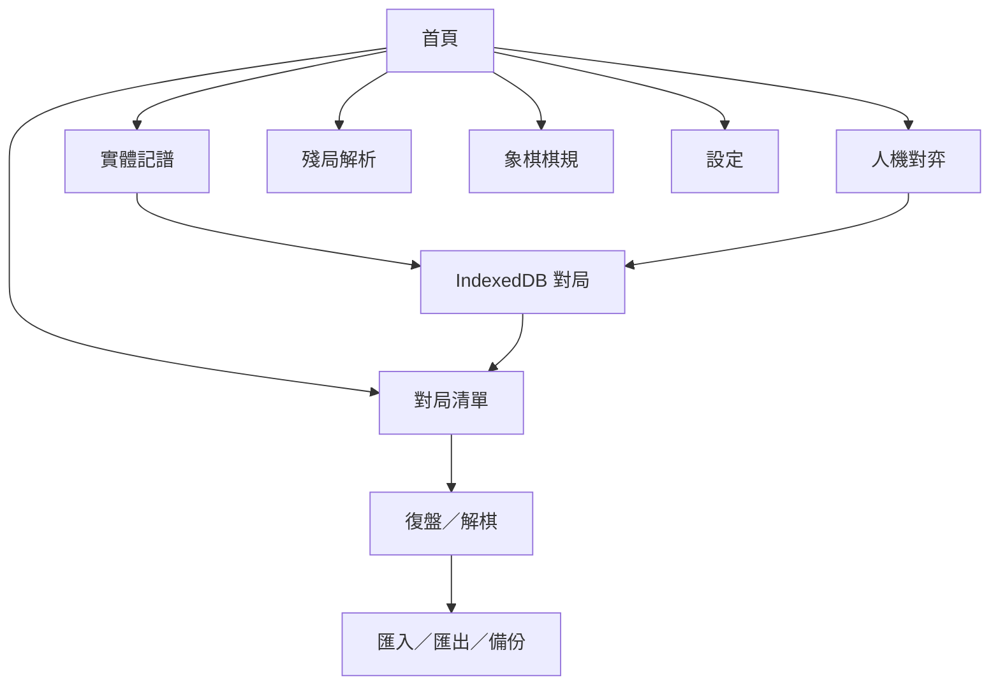
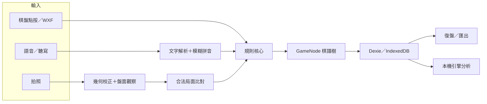

# 象棋記譜 Living SDD

> 文件狀態：Living（持續維護）<br>
> 文件版本：1.4<br>
> 最後更新：2026-07-17<br>
> 程式基準：`main` / `1cf403f`<br>
> 使用者文件：[README.md](../README.md)<br>
> 施工工作包：[docs/sdd/README.md](sdd/README.md)

這份文件是「象棋記譜」的產品與技術單一事實來源。README 回答怎麼使用 App；本文件回答為什麼這樣做、哪些原則不可破壞、資料如何流動，以及下一位施工者應如何安全接手。

若程式現況與本文件不一致，先把差異列為風險，不要默默選一邊。完成修正時，程式與 SDD 必須在同一次施工中同步更新。

## 1. 產品定位

### 1.1 一句話

為實體中國象棋對局提供本機優先、可離線使用的記譜、復盤、解棋與殘局工具。

### 1.2 產品方向

下列三個方向同時保留，不互相排斥：

1. 作者自己在真實棋盤旁使用。
2. 公開免費提供棋友使用。
3. 未來在授權與技術條件允許時商業化。

商業化不得犧牲目前的隱私、本機優先與可攜性。現有 Fairy-Stockfish／NNUE 為 GPL-3.0，任何商店化或閉源方案都必須先重新評估授權邊界；詳細現況見 README 的授權章節。

### 1.3 核心使用情境

- 手機放在棋盤旁，雙方在實體棋盤對弈並即時記譜。
- 使用者透過語音、拍照或點棋盤輸入著法。
- 使用者與本機引擎對弈並自動留下棋譜。
- 對既有棋局復盤、建立變著、加註解、匯入與匯出。
- 以本機引擎解棋、查看失誤與建議變化。
- 從空盤或照片建立殘局並分析。

### 1.4 現階段非目標

- 不建立帳號、雲端後端或跨裝置即時同步。
- 不宣稱 App 的級／段等同協會認證棋力。
- 不把使用者的棋譜、照片、校準資料自動上傳。
- 不把純討論、規劃或尚未驗收的施工部署到正式站；已確認且驗證完成的功能／介面施工預設直接部署。

## 2. 已確認的產品決策

| ID | 決策 | 不可破壞的界線 |
|---|---|---|
| D-001 | 本機優先、零後端 | 對局與設定預設只存在目前瀏覽器的 IndexedDB。 |
| D-002 | 三條主要輸入路徑等權 | 語音、拍照、點棋盤都必須容易發現；WXF 鍵盤屬手動輸入的輔助方式。 |
| D-003 | 台灣繁體中文與象棋品牌 | 首頁使用「帥」等中國象棋視覺，不使用西洋棋 `♟️` 作品牌圖示。 |
| D-004 | 難度使用台灣棋友熟悉的級／段名稱 | UI 隱藏西洋棋 Elo；必須清楚說明這是 App 相對階梯、不是棋力認證。 |
| D-005 | 先建立 10 個固定校準錨點 | 錨點設定須可版本化，之後才能逐步補齊完整段級。 |
| D-006 | 段級校準先在本機收集 | 校準資料不自動跨裝置；需要透過版本化匯出／匯入搬移或合併。 |
| D-007 | 校準實驗室預設隱藏並以 PIN 開啟 | PIN 只防止誤入，不可宣稱是強加密或真正權限系統。 |
| D-008 | 完成施工後預設 commit、push、deploy | 通過驗證後依序提交、推送、Firebase 部署並驗證正式站；當次明確要求不部署時才略過。 |
| D-009 | 棋規以協會 113 年修訂版為參考，確定規則才自動判定 | App 自動處理合法著法、絕殺與困斃；重複盤面、自然限著與長捉只提示／輔助，不冒充正式裁判。 |

## 3. 現行功能基準

| 區域 | 現況 | 主要入口／檔案 |
|---|---|---|
| 首頁 | 「帥」品牌、3D 中國漫畫風卡片、山景祥雲背景、三種輸入提示、最近對局 | `src/ui/HomePage.tsx`, `src/styles.css` |
| 實體記譜 | 姓名、先手、面對面模式、語音／WXF／棋盤點按／照片、合法著法、悔棋 | `src/ui/RecordPage.tsx` |
| 人機對弈 | 執紅／執黑、級段階梯、提示、悔棋、認輸、自動記譜 | `src/ui/PlayPage.tsx`, `src/ui/playLevels.ts` |
| 對局清單 | 依復盤或分析意圖選局 | `src/ui/GamesPage.tsx` |
| 復盤 | 主線／變著、播放、註解、匯入、匯出、備份 | `src/ui/ReplayPage.tsx`, `src/ui/ImportDialog.tsx` |
| 解棋 | 本機引擎逐著分析、評分曲線、著法標記、建議變化 | `src/engine/analysis.ts` |
| 殘局 | 擺盤合法性檢查、照片擺盤、MultiPV 分析、試走 | `src/ui/EndgamePage.tsx` |
| 拍照辨識 | 棋盤偵測、透視校正、紅黑／空格判斷、合法著法比對、棋子分類 | `src/vision/` |
| 棋子外觀校準 | 拍標準開局照，建立目前棋具的本機範本 | `src/ui/CalibrateDialog.tsx`, `src/vision/templates.ts` |
| 段級校準實驗室 Phase 1 | 預設隱藏、PIN 上鎖、10 個固定錨點、匿名協助者、本機 JSON 匯出；尚未開放校準對弈 | `src/calibration/`, `src/store/rankCalibration.ts`, `src/ui/RankCalibrationPage.tsx` |
| 棋規中心 | 113 年版勝負和摘要、循環判定矩陣、長捉例外與實體規則邊界 | `src/core/adjudication.ts`, `src/ui/RulesPage.tsx` |
| 設定 | 語音、面對面模式、分析強度、照片校準、授權資訊；feature gate 開啟後顯示段級校準入口 | `src/ui/SettingsPage.tsx` |
| 回饋 | 透過使用者自己的郵件 App 寄送，可附診斷資訊 | `src/ui/FeedbackDialog.tsx` |

注意：「棋子外觀校準」與未來的「段級棋力校準」是兩套不同功能。命名、資料表與畫面不可混用。

## 4. 穩定需求與驗收依據

| ID | 需求 | 最低驗收 |
|---|---|---|
| FR-HOME-001 | 首頁一眼可辨識為中國象棋 App。 | 不出現西洋棋品牌圖案；主要功能可由鍵盤與觸控操作。 |
| FR-INPUT-001 | 語音、拍照、點棋盤三路徑等權呈現。 | 首頁或記譜入口同時呈現三者，不以其中一種取代其他路徑。 |
| FR-RECORD-001 | 只有符合目前局面的合法著法可寫入棋譜。 | 所有輸入最後都經過規則核心驗證。 |
| FR-DATA-001 | 對局進度必須持續保存。 | 中途離開後可從 IndexedDB 回到未完成對局。 |
| FR-REPLAY-001 | 棋譜可保留主線、變著與註解。 | 匯出／匯入後結構不應靜默遺失。 |
| FR-ENGINE-001 | 引擎只在支援的瀏覽器環境啟用。 | 缺少 HTTPS、COOP／COEP 或 SharedArrayBuffer 時，記譜仍可用並顯示說明。 |
| FR-RANK-001 | 對弈難度顯示台灣棋友可理解的級／段。 | UI 不顯示內部 Elo，且不暗示協會認證。 |
| FR-RULES-001 | 棋友可在 App 內查閱適用的勝負和及循環棋規。 | 不把重複盤面直接判和；循環矩陣符合協會 113 年版，複雜長捉保留人工確認。 |
| FR-CAL-001 | 未來段級校準資料預設只在本機累積。 | 無網路請求；不同瀏覽器／裝置不會自動共享。 |
| FR-PRIVACY-001 | 棋譜、照片、校準結果不得在未告知下離開裝置。 | 任何新增上傳／分析服務都要另開 SDD 並取得明確同意。 |
| FR-RELEASE-001 | 每次施工可重現、可追查、可直接檢視。 | SDD、測試、build、commit、push、Firebase deploy 與 live verification 都有紀錄。 |

## 5. 使用者流程與導航

目前沒有 URL Router；`src/App.tsx` 以 React state 保存當前 View。重新整理頁面會回到首頁，這是現況而不是保證不變的產品需求。



### 5.1 實體記譜輸入

三條主要產品路徑如下：

1. **語音**：Web Speech API；不支援時降級為系統鍵盤聽寫。
2. **拍照**：照片 → 棋盤四角 → 透視校正 → 90 格觀察 → 合法著法候選 → 使用者確認。
3. **點棋盤**：點起點與終點直接走子。

WXF 代號鍵盤是手動輸入的進階輔助，不另算第四條產品入口。無論來源為何，寫入前都必須經過合法著法與目前局面檢查。

### 5.2 棋規與對局判決

棋規中心依中華民國象棋文化協會《中華民國象棋規則 113 年修訂版》整理，只收錄 App 情境需要的部分：

- 合法著法、絕殺與困斃由規則核心自動判斷。
- 協議和、認輸、超時與賽事犯規由棋友確認後記錄。
- 連續 100 著未吃子只提示自然限著審查，不自動結束。
- 循環局面由棋友先分類雙方為長將、長捉或未犯例，再由 App 套用比較矩陣；相同局面重複本身不等於和棋。
- 摸子、離手、按鐘、遲到與賽場紀律等 App 無法觀察的規則不納入自動判定。

長捉牽涉根子、同類子、牽制、兵卒／將帥及分捉多子等例外。在沒有裁判案例資料與專家驗證前，不得把自動長捉分類標示為可靠功能。詳細規格見 [004-xiangqi-rules-centre.md](sdd/004-xiangqi-rules-centre.md)。

## 6. 技術架構

### 6.1 技術棧

- React 18 + TypeScript + Vite。
- Dexie／IndexedDB 本機資料庫。
- `vite-plugin-pwa` 與 Service Worker 離線快取。
- Fairy-Stockfish Xiangqi WASM + NNUE，透過 Web Worker 執行。
- 純 TypeScript 規則、記譜、照片幾何與分類流程；執行期不依賴 OpenCV 或雲端模型。
- Firebase Hosting 正式部署；`public/_headers` 保留其他支援自訂標頭的平台。

### 6.2 資料與運算流



### 6.3 模組責任

| 目錄 | 責任 | 變更注意事項 |
|---|---|---|
| `src/core/` | 棋盤、FEN、合法著法、記譜格式、棋譜樹、匯入／匯出 | 應維持純函式與高測試覆蓋；UI 不得自行重寫規則。 |
| `src/store/` | Dexie schema、設定、玩家名冊、備份 | schema 變更必須版本化並設計 migration。 |
| `src/speech/` | 能力偵測、一次語音辨識、TTS | 平台差異以執行期偵測處理。 |
| `src/vision/` | 棋盤偵測、透視、分類、合法著法比對、棋子範本、CNN | 真實照片資料不足時不可誇大準確率。 |
| `src/engine/` | Worker 引擎介面、全局排隊、逐著分析 | 每次分析都要明確重設限制棋力，避免弱棋設定污染解棋。 |
| `src/calibration/` | 段級校準 schema、PIN KDF 與版本固定錨點 | 不可把底層尺度顯示為中國象棋段級；任何影響棋力的設定變更都要換 config version。 |
| `src/ui/` | 頁面、對話框、棋盤互動、產品文案 | 維持台灣繁中、觸控優先、鍵盤可達與一致視覺。 |
| `public/engine/` | Worker、WASM、NNUE | 大檔快取與 GPL 來源必須可追溯。 |
| `training/` | 開發側 CNN 合成資料與訓練 | 產物須可重現；不得提交授權不明資料。 |

## 7. 資料模型與資料邊界

### 7.1 目前 Dexie schema（version 2）

- `games`：對局基本資料、模式、玩家、結果、初始 FEN、棋譜樹、著數與分析結果。
- `players`：曾使用的玩家名稱。
- `settings`：key/value 設定；包含語音、分析、面對面模式與 `pieceCalibration` 棋子範本。
- `rankCalibrators`：匿名協助者 profile、自報級／段、制度來源與本機同意時間。
- `rankCalibrationGames`：預留完整校準原始棋局；Phase 1 不會建立資料。

version 2 只新增上述兩張表，不改寫既有 `games`、`players`、`settings`。段級校準 feature gate 與 salted PIN verifier 存在 `settings.rankCalibrationGate`；unlock flag 只存在 React memory。

對局以 `GameNode` 樹保存主線與分支，不是單純的線性著法陣列。修改棋譜時要保留節點 ID、主線順序與分支語意。

### 7.2 本機資料的實際範圍

- 資料屬於「瀏覽器 profile + 網站 origin」。
- `https://xiangqi-recorder.web.app`、`http://localhost` 與其他網域彼此不共享資料。
- 換電腦、換瀏覽器、清除網站資料或使用無痕模式都可能看不到原資料。
- 目前不會自動同步；唯一可攜方式是使用者主動匯出與還原。

### 7.3 現有備份限制

`src/store/backup.ts` 的 version 1 只包含 `games`，不包含：

- App settings。
- 玩家名冊（還原對局時會重新建立相關名字）。
- 棋子照片校準範本。
- 段級校準 profiles／games（目前需從隱藏實驗室另行匯出 schema v1 JSON）。

因此「完整可攜備份」仍是待補強項目。未來擴充備份格式時必須保留 schema version、向後相容與重複匯入策略。

## 8. 引擎難度與段級校準

### 8.1 現行難度

`src/ui/playLevels.ts` 提供 `業餘10級` 到 `業餘9段` 的相對階梯。內部目前使用引擎限制棋力與思考時間形成單調難度，但底層尺度不是中國象棋協會等級分。

產品界線：

- UI 只顯示級／段名稱，不顯示西洋棋 Elo。
- 不可由「擊敗某段」推論使用者擁有該段位。
- 提示、復盤與解棋應使用全力，不受對弈弱棋力設定污染。
- 對局紀錄保存當時的引擎顯示名稱，避免日後改表導致舊棋譜改名。

### 8.2 校準方向

目前沒有人類棋手可立即協助校準，因此公開難度表仍是未驗證的相對階梯。下一階段採用：

1. 建立 10 個版本固定的內部錨點。
2. 引擎落子加入可記錄、可重現的人類化選著策略。
3. 建立預設隱藏、PIN 解鎖的本機校準實驗室。
4. 協會棋手先輸入自己的級／段，再像正常對弈一樣完成校準棋局。
5. 原始棋局與統計只保存在當前電腦／瀏覽器；透過匯出檔帶回分析。
6. 資料足夠後才版本化發布映射，逐步補齊完整段級。

Phase 1 已凍結 `A01`～`A10` 的 `2026.07-v1` 設定並完成本機 PIN／profile／匯出骨架，但刻意不開放校準對弈；humanized policy、seed、候選著與匯入合併屬下一階段。

詳細施工規格見 [002-local-rank-calibration-lab.md](sdd/002-local-rank-calibration-lab.md)。

## 9. 非功能需求

### 9.1 離線與可靠性

- App shell、規則、既有棋譜、照片運算與已快取引擎可離線。
- Android Web Speech API 可能需要網路；iOS standalone 走系統聽寫降級。
- NNUE 首次使用需下載約 11 MB，成功後由 Service Worker 快取。
- IndexedDB 寫入失敗時不得假裝已保存；重要資料操作應提供可理解的錯誤。

### 9.2 隱私與安全

- 零後端是預設架構，不是暫時省略的實作細節。
- 照片只在本機記憶體處理，除非另有明確、可撤回的上傳同意。
- Feedback 使用 `mailto:`，最終寄送由使用者在郵件 App 確認。
- 未來 PIN 僅作功能門禁；本機前端無法對有裝置與開發工具權限的人提供真正機密性。
- 不得把 API Token、密碼、真實棋手個資或未匿名校準資料提交到 Git。

### 9.3 可用性與無障礙

- 觸控目標應適合手機；不得只靠 hover 表達狀態。
- 互動元素需有可辨識名稱與 `focus-visible` 狀態。
- 支援窄螢幕、safe-area、深色模式與 `prefers-reduced-motion`。
- 文案使用台灣繁體中文與全形中文標點。

### 9.4 部署條件

- 正式站必須是 HTTPS。
- 引擎需要 `Cross-Origin-Opener-Policy: same-origin` 與 `Cross-Origin-Embedder-Policy: require-corp`。
- `firebase.json` 與 `public/_headers` 必須同步保留上述標頭。
- Service Worker／`index.html` 的 cache policy 不可讓新版長期卡在舊 shell。

## 10. 品質門檻與 Definition of Done

每一個施工工作包至少完成：

1. 施工前建立或更新工作包 SDD，寫明範圍、非範圍、風險與驗收條件。
2. 程式、測試與使用者文案同步修改。
3. 執行與改動相稱的測試；基準指令為 `npm test`。
4. 執行 `npm run build`，不得留下新增的編譯或 CSS syntax error。
5. UI 變更至少檢查 320、390、640 px；重要流程需實際點擊。
6. IndexedDB／PWA／相機／語音等瀏覽器能力，應在真正支援該 API 的瀏覽器驗證；受限的自動化瀏覽器不能替代實機。
7. 更新 master SDD、工作包狀態與 README（若使用方式改變）。
8. 檢查 `git diff`，只提交本次範圍。
9. 建立語意清楚的 commit 並 push 到遠端。
10. 已確認的功能／介面施工預設在 push 後 deploy，並驗證正式 URL；當次明確說不要部署時才停在 Git。

目前測試基準（2026-07-17）：11 個 test files、90 tests 全部通過。

## 11. 開發與發布 Runbook

```bash
npm install
npm test
npm run build
npm run dev
```

Git 施工收尾：

```bash
git status --short
git diff --check
git add <本次檔案>
git commit -m "<type>: <清楚摘要>"
git push origin <目前分支>
```

正式部署（已確認施工完成後的預設步驟）：

```bash
npm run build
firebase deploy --only hosting
```

部署後還要驗證首頁、Service Worker 更新、`crossOriginIsolated` 與引擎載入。不要因為 Git push 或 Firebase CLI 回報成功，就跳過正式網址檢查。

## 12. 已知風險與技術債

| 項目 | 影響 | 建議 |
|---|---|---|
| 版本來源不一致 | `package.json` 為 0.1.0，Feedback 顯示 0.3.0。 | 建立單一版本來源並由 build 注入。 |
| 備份不含設定與校準 | 換機後照片範本與未來段級資料會遺失。 | 設計 backup schema v2 與匯入合併規則。 |
| 無 URL Router | 重新整理會回首頁，無法深連結到棋局。 | 若要改，另開 SDD 並處理 PWA rewrite。 |
| 級段尚未經人類校準 | 顯示名稱可能與真實棋力落差很大。 | 維持免責文字，完成 002 工作包後再發布映射。 |
| 人類化選著尚未定義 | 弱化引擎可能仍不像真人。 | 固定策略版本、亂數 seed 與完整決策紀錄。 |
| 長捉無法可靠自動分類 | 循環局面若直接自動判決可能誤判勝負。 | 維持人工分類＋矩陣輔助；取得裁判案例與專家驗證後另開 SDD。 |
| CNN 主要由合成資料訓練 | 真實棋具泛化能力未知。 | 以使用者棋子範本為主，累積合法且有授權的實拍驗證集。 |
| Web Speech 平台差異 | iOS PWA 與部分瀏覽器無即時辨識。 | 保留鍵盤聽寫與手動輸入降級。 |
| 引擎依賴 COOP／COEP | 錯誤部署會讓分析失效。 | 部署後檢查標頭與 `crossOriginIsolated`。 |
| GPL 商業限制 | iOS App Store／閉源散布有風險。 | 商業決策前做正式法律與架構評估。 |
| PWA metadata 尚未完整描述拍照 | 安裝資訊仍偏重語音／點按。 | 後續文案施工同步 `index.html`、manifest、package。 |

## 13. 路線圖

### 已發布

- 首頁中國象棋品牌與卡片視覺整理（工作包 001，2026-07-16 發布）。
- 首頁 3D 中國漫畫風主題（工作包 003，2026-07-16 發布）。
- 本機段級校準實驗室 Phase 1（工作包 002，2026-07-16 發布；後續 phase 仍需另行核准）。
- 象棋棋規中心與循環判定輔助（工作包 004，2026-07-17 發布）。

### 下一階段候選

1. 本機段級校準實驗室 Phase 2：humanized policy v1、seed／候選紀錄、校準對弈與匯入去重（工作包 002，需另行核准）。
2. 完整備份格式 v2，納入 settings、棋子校準與段級校準資料。
3. 統一 App 版本來源。
4. 對手統計、ECCO 開局分類、每著計時／棋鐘。
5. XQF 匯入、全離線語音、選配 AI 白話講解。

路線圖順序仍由產品負責人確認；候選項目不得因出現在本文件就視為已授權施工。

## 14. 新接手者快速檢查

1. 先讀本文件，再讀 [施工工作包索引](sdd/README.md)。
2. 查看 `git status --short`、目前分支與最近 commits。
3. 找出目標工作包的 Status、Open Questions 與 Acceptance Criteria。
4. 執行 `npm test` 與 `npm run build` 建立乾淨基準。
5. 確認不會把本機 IndexedDB、密鑰、照片或個資帶進 commit。
6. 施工中同步更新 SDD，不要等到最後憑記憶補寫。
7. 完工後 commit、push、Firebase deploy 並驗證正式站；若當次不要部署，產品負責人會明確說明。

## 15. 文件變更紀錄

| 日期 | 版本 | 內容 |
|---|---|---|
| 2026-07-17 | 1.4 | 加入協會 113 年版棋規邊界、勝負和、循環比較矩陣、自然限著提醒與長捉人工確認原則。 |
| 2026-07-16 | 1.3 | 記錄 Dexie v2、段級校準實驗室 Phase 1、10 個固定錨點、PIN 門禁與獨立匯出資料邊界。 |
| 2026-07-16 | 1.1 | 將已確認施工的預設收尾改為 commit、push、Firebase deploy、live verification；記錄首頁工作包正式發布。 |
| 2026-07-16 | 1.0 | 建立 master SDD，統整產品、架構、資料邊界、難度校準方向與施工交接規範。 |
